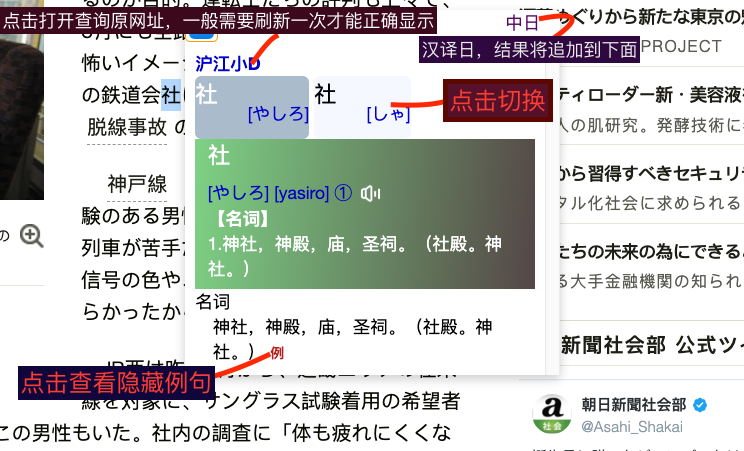

## 日语划词词典

[github主页](https://github.com/fthvgb1/tampermonkey-script)

### 说明

调用沪江小d的网页

fork自 https://github.com/barrer/tampermonkey-script 修改的，并参考了 http://uusama.com/648.html 

### 截图

### 功能

* 只调用沪江小D查询日语，可以点击语音按钮发音
* 默认是日中查询，没有结果时自动使用中日查询，日中查询有结果有添加主动中日查询的按钮
* 有多个意思和发音时，可以点击切换
* 支持浏览器：Google Chrome、Firefox、Safari、Firefox for Android（无拖动）
* 支持图标拖动
* 支持面板自动调整位置

### 其它

安装地址：

https://greasyfork.org/zh-CN/scripts/394792

**使用前：**  先安装猴油脚本之类的扩展
[https://tampermonkey.net/](https://tampermonkey.net/)  
下载对应浏览器的扩展程序

### ps

前端苦手，样式好难啊。